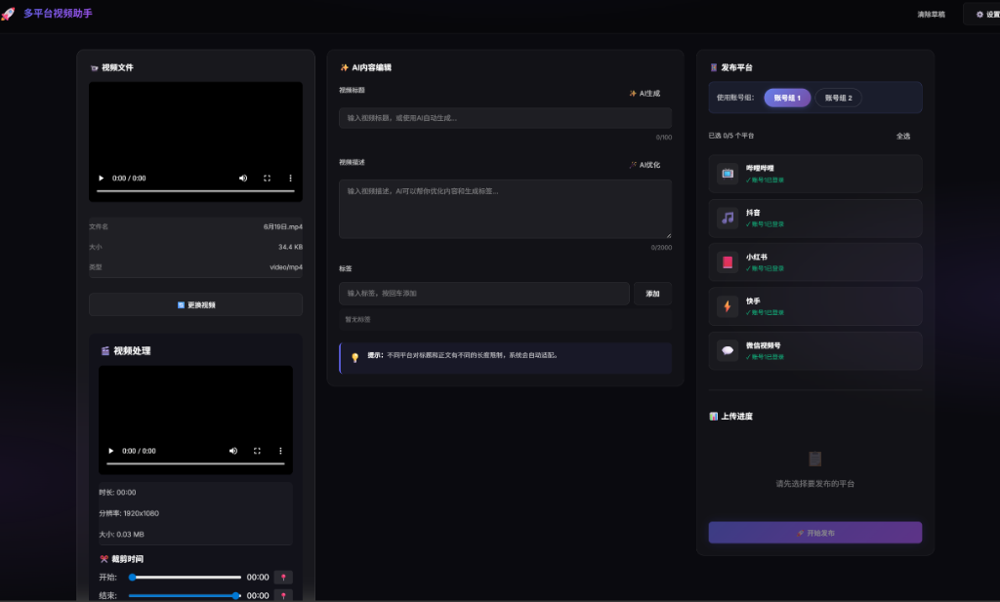

# Multi-Platform Video Uploader / 多平台视频上传助手

<p align="center">
  
</p>

<p align="center">
  <strong>🚀 Upload videos to multiple platforms with one click</strong><br>
  <strong>🚀 一键上传视频到多个平台</strong>
</p>

<p align="center">
  Supports Douyin, Kuaishou, Bilibili, Xiaohongshu, WeChat Channels<br>
  支持抖音、快手、B站、小红书、微信视频号
</p>

<p align="center">
  <a href="#features--功能特性">Features</a> •
  <a href="#quick-start--快速开始">Quick Start</a> •
  <a href="#usage--使用方法">Usage</a> •
  <a href="#faq--常见问题">FAQ</a>
</p>

---

## 界面预览 / Screenshot

<p align="center">
  
</p>

---

## Features / 功能特性

### 核心功能

| Feature | 功能 | 说明 |
|---------|------|------|
| 📹 Multi-Platform | 多平台支持 | 支持5大主流视频平台一键发布 |
| 👥 Dual Account | 双账号组 | 每个平台支持账号组1/2，独立缓存互不干扰 |
| 🤖 AI Content | AI 内容生成 | 一键生成标题、优化描述、自动打标签 |
| 🎬 Video Editor | 视频处理 | 支持裁剪、倍速、静音等预处理 |
| 🔐 Cookie Login | 持久登录 | Cookie 自动保存，无需反复扫码 |
| 🖥️ Visible Browser | 可视化操作 | 浏览器可见，支持手动确认后发布 |

### 平台特性

| Platform | 平台 | 自动功能 |
|----------|------|----------|
| 📺 Bilibili | 哔哩哔哩 | 标题、简介、标签、**自动勾选自制** |
| 🎵 Douyin | 抖音 | 作品描述、话题标签 |
| 📕 Xiaohongshu | 小红书 | 标题、正文、话题、**自动声明原创** |
| ⚡ Kuaishou | 快手 | 描述、话题、**自动关闭新手指引** |
| 💬 WeChat | 微信视频号 | 描述、话题、**自动声明原创** |

### 视频处理功能

- ✂️ **裁剪** - 设置开始/结束时间，精确裁剪视频片段
- ⏩ **倍速** - 0.5x ~ 2x 播放速度调整
- 🔇 **静音** - 移除原视频声音
- 📐 **预览** - 实时预览处理后的视频

---

## Quick Start / 快速开始

### 环境要求

- [Node.js](https://nodejs.org/) 18+
- Windows 10/11

### 安装步骤

```bash
# 1. 克隆项目
git clone https://github.com/your-username/multi-platform-uploader.git
cd multi-platform-uploader

# 2. 安装依赖
npm install

# 3. 安装浏览器
npx playwright install chromium

# 4. 启动服务
npm run dev
```

### 一键启动 (Windows)

双击 `启动.bat` 即可自动完成依赖安装并启动服务。

启动后访问: **http://localhost:5173**

---

## Usage / 使用方法

### 1. 登录平台

首次使用需要登录各平台：

1. 选择使用的**账号组**（账号组1 或 账号组2）
2. 点击平台卡片上的 **🔄** 登录按钮
3. 在弹出的浏览器中完成扫码登录
4. 登录成功后关闭浏览器窗口

> 💡 两个账号组的登录状态完全独立，可以绑定不同账号

### 2. 上传视频

1. **拖拽视频** - 将视频文件拖拽到左侧上传区域
2. **视频处理**（可选）- 使用裁剪、倍速、静音等功能
3. **填写信息** - 输入标题和描述，或点击 AI 生成
4. **添加标签** - 输入话题标签
5. **选择平台** - 勾选要发布的平台
6. **开始发布** - 点击"开始发布"按钮

### 3. 手动确认

脚本会自动填写所有信息，但**不会自动点击发布按钮**。你需要：

1. 检查每个平台标签页的内容
2. 确认无误后手动点击发布

---

## Configuration / 配置说明

### AI 服务配置

点击右上角 ⚙️ 设置按钮配置 AI 服务：

| 服务商 | 获取 API Key |
|--------|-------------|
| OpenAI | [platform.openai.com](https://platform.openai.com/) |
| DeepSeek | [platform.deepseek.com](https://platform.deepseek.com/) |
| Moonshot | [platform.moonshot.cn](https://platform.moonshot.cn/) |
| Ollama | 本地运行，无需 Key |

### 默认标签

可在设置中配置默认标签，上传时自动添加。

---

## Project Structure / 项目结构

```
multi-platform-uploader/
├── src/                    # 前端源码
│   ├── components/         # React 组件
│   │   ├── VideoUploader   # 视频上传
│   │   ├── VideoEditor     # 视频处理
│   │   ├── AIEditor        # AI 内容编辑
│   │   ├── PlatformSelector # 平台选择
│   │   └── ...
│   └── App.jsx             # 主应用
├── server/                 # 后端服务
│   ├── routes/             # API 路由
│   ├── services/           # 核心服务
│   │   ├── browserManager  # 浏览器管理（多账号独立上下文）
│   │   └── platformUploader # 各平台上传逻辑
│   ├── cookies/            # Cookie 存储（按账号组分开）
│   └── uploads/            # 上传文件
├── 启动.bat                # Windows 启动脚本
└── README.md               # 说明文档
```

---

## FAQ / 常见问题

### Q: 登录后显示未登录？

Cookie 可能已过期，点击平台卡片的 **🔄** 按钮重新登录。

### Q: 两个账号组有什么区别？

两个账号组拥有完全独立的浏览器上下文和 Cookie 存储，可以分别绑定不同的账号。适合多账号运营场景。

### Q: 上传失败怎么办？

1. 检查网络连接
2. 确认已登录对应平台
3. 查看控制台日志定位问题

### Q: 快手/小红书有弹窗挡住了？

脚本会尝试自动关闭新手指引等弹窗。如果仍有问题，手动关闭即可。

### Q: 视频处理后在哪里？

处理后的视频保存在 `server/processed/` 目录，上传时会自动使用处理后的版本。

---

## Contributing / 贡献

欢迎提交 Issue 和 Pull Request！

## License / 开源协议

[MIT License](LICENSE)

## Disclaimer / 免责声明

本项目仅供学习交流使用，请遵守各平台的使用条款。因使用本工具产生的任何问题，作者不承担责任。
